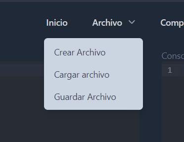

# **PROYECTO 2**

### Universidad de San Carlos de Guatemala

### Facultad de Ingeniería

### Escuela de Ciencias y Sistemas

### Organización de Lenguajes y Compiladores 1

### Sección C

  

## **Manual de Usuario**

  

| Nombre                   | Carnet    |
| ------------------------ | --------- |
| José Manuel Ibarra Pirir | 202001800 |

---
# Introducción 
Bienvenido al manual de usuario del software de análisis de archivos utilizando el método del árbol. Este software ha sido desarrollado para facilitar el análisis léxico y sintáctico de archivos utilizando autómatas finitos deterministas y no deterministas.

Este manual tiene como objetivo proporcionar una guía detallada sobre cómo utilizar el software, desde su instalación hasta su uso y resolución de problemas. Se espera que este manual sea de utilidad para usuarios con conocimientos básicos de programación y que estén interesados en realizar análisis de archivos de manera eficiente.

En este manual se proporcionará una descripción detallada de los requerimientos del sistema, los pasos para la instalación del software, una guía sobre cómo utilizar el software y una sección sobre solución de problemas comunes. Además, se proporcionará una lista de referencias y apéndices para mejorar la comprensión del método del árbol y la utilización del software.

Esperamos que este manual sea de ayuda para usted y que logre utilizar el software de manera efectiva. Si tiene alguna duda o problema durante la utilización del software, no dude en contactar al equipo de soporte para obtener ayuda adicional.

¡Gracias por utilizar nuestro software y esperamos que tenga una experiencia de usuario satisfactoria!
# Requerimientos mínimos del sistema
- Sistema operativo: Windows 11.
- Memoria RAM: mínimo 2 GB.
- Espacio en disco duro: mínimo 200 MB.
- Navegador web: Google Chrome, Mozilla Firefox, Microsoft Edge.
# Uso del Software
## Interfaz Inicial
Se muestra la interfaz inicial del software, en la cual se puede observar el menú principal, el área de trabajo, area de imagenes y la consola.  
 

Si se hace click en Archivo se desplegarán las siguientes acciones con las que se puede interactuar:
- Inicio: Crea un nuevo archivo.
- Archivo: Abre un archivo existente.
- Compilar: Guarda el archivo actual.
- Reportes: Guarda el archivo actual con un nombre diferente  
 

Si hace click en Arbir archivo se colocará el contenido del archivo en el área de trabajo.  
 
